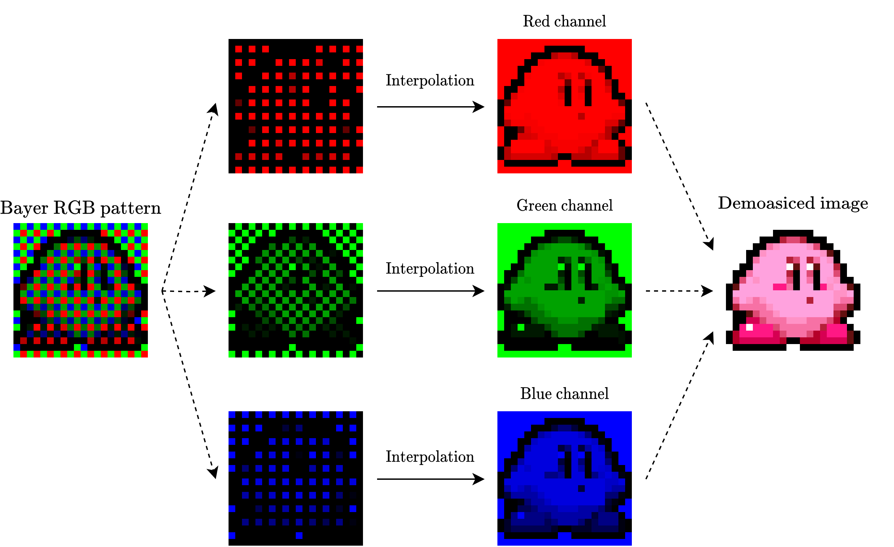

# demosaic

An efficient image demosaicing algorithm written in C.

A full report on this library can be found [here.](./report/Image%20Debayering%20by%20Bilinear%20Interpolation.pdf)

# Introduction

Image demosaicing (also known as image debayering, named after the Bayer filter) is a process used to
interpolate data within an image that has had a mosaic filter applied. The most common application of this
technique in engineering contexts is for demosaicing CMOS sensor images, which predominantly use the
Bayer filter, shown in Figure 1. Today, nearly all commercially sold digital cameras employ CMOS
sensors to capture images, and thus depend upon a demosaicing algorithm of some kind.


*Figure 1: Image demosaicing process.*

In many cases such as RAW-format digital photography, image information is saved as a mosaic, and
demosaicing is performed during image rendering. However, there are common scenarios where
demosaicing must be performed in real time. For example, one of the most common video compression
techniques involves converting from the RGB color space into a different color space (for example, the
YCC color space) that more efficiently conveys visual information. Because this process cannot work on
image frames that have a mosaic filter applied, a demosaicing algorithm must interpolate missing
information in the image in real time before the image frame can be compressed

# Running the Program

## Prerequisites
You should be on `seng440.ece.uvic.ca`.

## Building the application

0. Clean any artifacts:
```bash
make clean
```

1. (Setup) encoding the images:
```bash
make encode
```

2. Compiling the demosaicing algorithm:
```bash
make arm
```

3. Running the algorithm:
```bash
make run
```

4. Generate the assembly:
```bash
make asm
```

The assembly is output to the /build directory.
